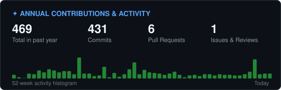
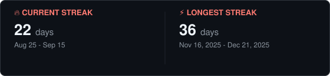
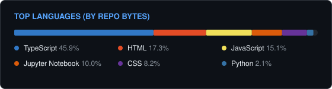
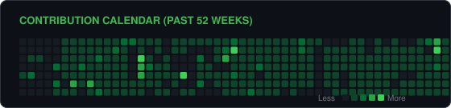

# 💫 Jamal Nadeem (`@beginnercodee`)

> **Computer Science Student & Automation Specialist**  
> Building high-impact web apps, AI integrations, and scalable business automation workflows.

---

### 👋 About Me

I’m Jamal Nadeem — a Computer Science student and Automation Specialist passionate about building modern, high-quality web applications and scalable business workflows. I enjoy turning ideas into polished, user-friendly products with attention to both functionality and design.

- 🔭 **Currently Working On:**
  - AI-powered web apps using **Next.js**, **Tailwind CSS**, and **Framer Motion**
  - End-to-end business automation pipelines using **n8n** and **GoHighLevel (GHL)**
  - SaaS project focused on AI-driven resume tailoring
- 🤝 **Open to Collaborate On:**
  - Frontend-heavy React / Next.js applications
  - Complex CRM & Automation implementations (GHL, Zapier, n8n)
  - Open-source developer tooling with real-world impact
- 🧠 **Exploring & Honing:**
  - Scaling full-stack applications & advanced system design
  - SaaS architecture & monetization strategies
  - Advanced Next.js (App Router) architectural patterns
- ⚡ **Philosophy:**
  - *“I care about UI polish almost as much as backend logic — small details matter.”*

---

### 💻 Tech Stack & Ecosystem

<b>🛠️ Technologies, Frameworks &amp; Tools</b>

 

**Frontend & Full-Stack:**  

 

**Backend, Languages & Runtimes:**  

 

**Databases & Cloud:**  

 

**⚙️ Automation & Business Systems:**  

 

**Machine Learning & Data Science:**  

 

**Tools & Design:**  

---

### 📊 Live GitHub Activity & Stats

> *Zero third-party widgets. Generated directly inside this repository by GitHub Actions + GraphQL API.*

  

  

  

  

#### 🐍 Contribution Snake

---

  Generated automatically by <a href="https://github.com/beginnercodee/beginnercodee/actions">GitHub Actions</a> • Self-hosted &amp; Deterministic

